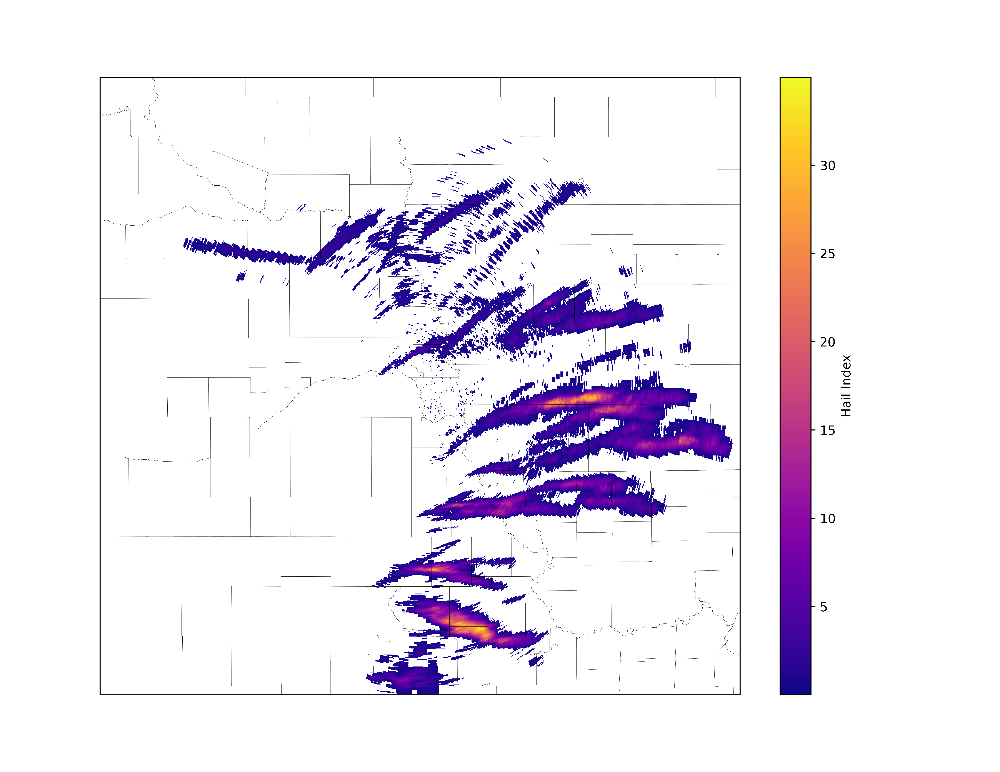

# ⛈️ Did It Hail?

This Python application is designed to process and animate hail data based on the NEXRAD Level 3 hydrometeor classification product. It uses a mix of things like MetPy, Matplot, Xarray, etc., to manipulate data available from NOAA's near-realtime radar data feeds.

**Example hail sum** over several hours of radar data around Omaha, NE, US:

